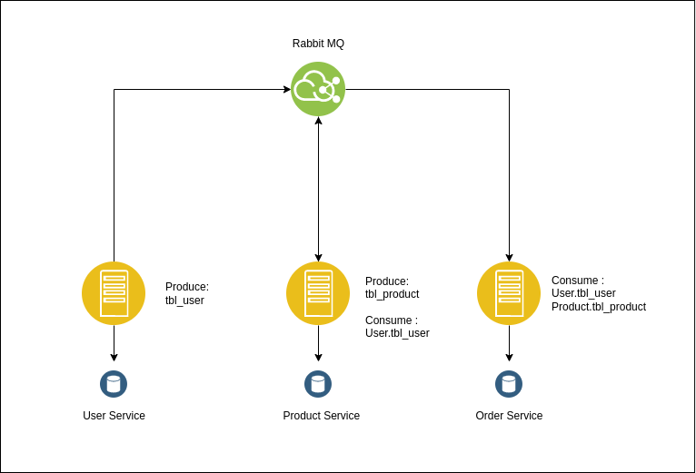

# Ecommerce-Service

 

> This repository contains microservices sample project for the purpose implementation of microservices with golang and rabbitMQ stack as message broker

## System Schema
 

